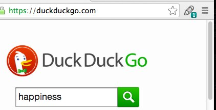
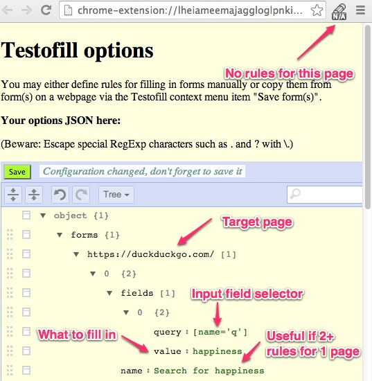
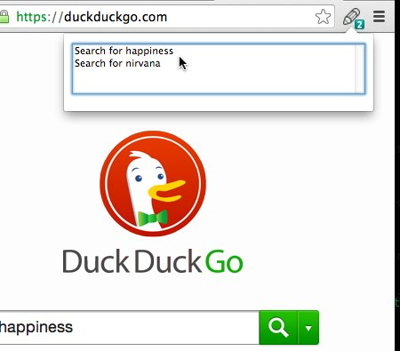
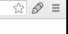
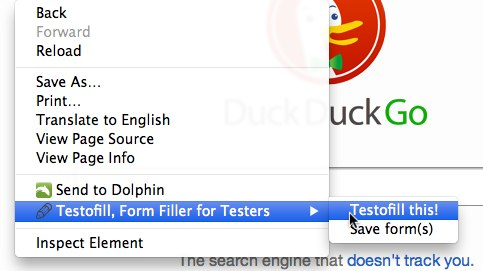

 Testofill, the Form Filler for Testers Chrome Extension
=======================================================================================

Goal: Enable testers to fill forms automatically/on-demand with predefined and/or generated values.
It is possible to define and choose from multiple sets of values for a given form.

State: Automatic/on-demand form filling with predefined values; possible to save values from a form.
No random input data generation yet (or soon).

Fields are found using CSS3 selectors (via [Sizzle](https://github.com/jquery/sizzle/wiki/Sizzle-Documentation#wiki-selectors)). The configuration of the plugin is a JSON object.
Forms are filled either automatically or when you click the plugin icon.

Based on [work by Akkunchoi](http://akkunchoi.github.io/Autofill-chrome-extension).

Description from Chrome Web Shop
--------------------------------

Testofill allows you to define one or more sets of rules for filling forms on a particular page and to fill them in automatically or on demand. It targets people that can write little CSS (such as "[name='myfield']") and that need to be able to choose from a sets of values to fill in. A typical example is a tester that needs to repeatedly fill in different search criteria to test her app and thus wants to define rule sets such as "Simple book search" and "Advanced book search".

The main advantages are being able to have multiple sets of values for a single form and having full access to and control over these values.

It is also possible to create rules automatically from a filled form and adjust them later.

More info at the project page (https://github.com/jakubholynet/Testofill-chrome-extension/).

Icon by Designmodo (https://www.iconfinder.com/icons/115700/edit_pen_pencil_write_icon).

Screenshots
-----------

1) Testofill has found one rule set for the current page:



2) Testofill configuration for that one match (also shows what the icon looks like when
there are no rule sets matching the current page):



3) Icon and popup when testofill has found multiple matches for the current page:



4) Sometimes Testofill gets confused and you need to close and reopen the page if you
want testofill to fill in forms on the page (notice there is neither a number nor "N/A" on the icon):



5) Context menu (when clicking on a page outside of input elements, links, and media):



Configuration
-------------

(Extensions - Testofill - Options)

The easiest thing is perhaps to go to a webpage with a form (forms), fill it in, right-click somewhere
on the page (outside of links and other special objects) and select "Save form(s)" from the
Testofill context menu.

You can also write the configuration manually - it is a simple JSON object where each page has its
URL mapped to a list of "rule sets" defined for it, each one consisting of a name and field rules.
Field rules is a list of simple objects having a Sizzle query for locating the input element and
the value to fill in.

The editor provides a graphical tree view and raw JSON with syntax highlighting and validation.

### Example configuration

```json
{
  "forms": {
    "me:1111/test.html.*#one": [
      {
        "fields": [
          {
            "query": "[name='q']",
            "value": "Single rule set rulez"
          }
        ],
        "name": "Form with one ruleSet"
      }
    ],
    "me:1111/test.html.*#two": [
      {
        "doc": "Set 1 of 2",
        "fields": [
          {
            "query": "[name='q']",
            "value": "Testofill rocks!"
          }
        ],
        "name": "Set Testofill rocks"
      },
      {
        "fields": [
          {
            "query": "[name='q']",
            "value": "Value from another ruleSet"
          }
        ],
        "name": "Set Another"
      }
    ]
  }
}
```

Installation
---------------

Either [install Testofill from Chrome Web Store](https://chrome.google.com/webstore/detail/testofill-form-filler-for/pkgdgajoinhkfldibdaledjikboognnl?hl=en-US)
or follow the manual installation instructions below.

First, clone/download this repository.

Next, open the Extensions page in Chrome, check "Developer mode"
and click "Load unpacked extension...", navigate to the `src``
directory of this repo. (You can then also click "Pack extension...".)

You also likely want to check "Allow in incognito mode" for the extension if you use incognito windows for testing.

After the installation, open the extension's options and modify at will.

ChangeLog
----------------

- 2014-3 v0.4 pre-release
  - Added context menu to save form(s) on the current page
- 2014-3 v0.3 pre-release
  - Added jsoneditor for better json editting
- 2014-02+03 v0.2 pre-release
  - Added context menu for windows w/o toolbar
  - Support for setting `textContent`
- 2014-02-03 v0.1 pre-release
  - JSON config using chrome.storage, move from jQuery to the smaller Sizzle,
    event page inst.of background, manifestv v 2
  - support multiple sets of values for the same form & selection from them
  - the icon's badge shows the number of ruleSets matching the URL
  - support radio, checkbox, select (single, multi)
- 2014-01 v0.0 release
  - Based on Autofill 1.0 (2012-09-26) + browser action, work on frames

Shortcomings
------------

- URL is matched against the page URL, not iframe URL even if the form is in an iframe
- Some JavaScript-activated forms are not filled automatically and you need to click
  the extension icon to fill them in

Todo
----------------

- Add debug option and debug statements
- Docs: Improve
- Currently the browserAction icon is reset when opening a cached URL - fix this
- Run setBadgeAndIconAction/autofill also when same url reloaded (diff evt?)
- FORM:
  - find by label?
- Config
  - add option for turning autocomplete on/off
  - save options on C-S / M-S
  - ? make allFrames configurable
- Random values
  - generated values (using predefined generators such as randomNumber, ability to add new generators, or a custom function)
- handle/test error cases - no sets, no set selected, ...

Development
-----------

Form filling is implemented in the content script
[`testofill-run.js`](https://github.com/jakubholynet/Testofill-chrome-extension/blob/master/src/testofill-run.js). See especially `fillForms` that finds fields matched by rules in a rule set and fills them via `fillField`, which applies a rule (its value, textContent etc.) to a field.

[`events.js`](https://github.com/jakubholynet/Testofill-chrome-extension/blob/master/src/events.js) contains the crucial `findMatchingRules`, which roles rule sets from options, finds those matching the current URL, and calls the provided callback for them. Behavior of the context menu and badge icon are defined here as well.

[`popup.js`](https://github.com/jakubholynet/Testofill-chrome-extension/blob/master/src/popup.js) defines the selection popup that opens when multiple rule sets match the current URL and that triggers form filling when one is selected.
